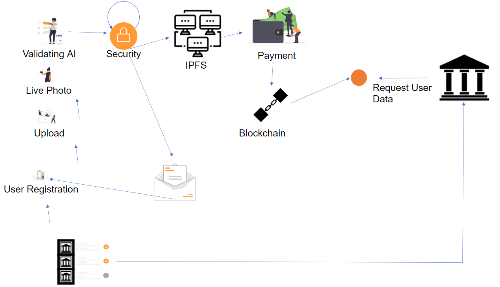
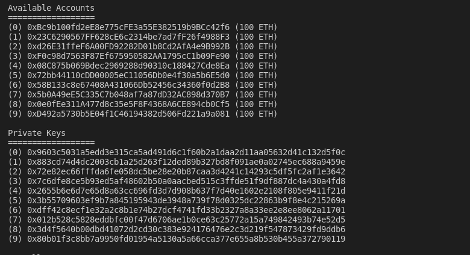

# BKyc
<hr>

[](https://forthebadge.com)
[](https://forthebadge.com)


Kyc in today's generation is the most important document for verification & authentication of user's identity.
Bkyc gives users full control of  kycs. By providing software as a service Bkyc simplifies 
onboarding and verification of user kyc using the ethereum blockchain. Kyc is encrypted using
AES-256 symmetric encryption and stored on IPFS (distributed Storage System). The cipher key is not stored 
on the server and is sent to the client due to which there cannot be leakage of kyc data of the users.

## Architecture
<hr>

[//]: # (Architecture image will be added here)



## System requirments
<hr/>

- Docker
- Node v12.13.0 (LTS)


## Running the project
<hr>

We have made developers life easier by adding docker to our project. With the help of a single command
user can build and run our entire project hazzel free.

### Steps to run our project-

#### Clone the project-
```
    git clone https://github.com/Hrushi20/BKyc.git
```
#### Install truffle globally using npm-
```
    npm install -g truffle
```
#### Open truffle folder in cloned directory and run-
```
    truffle build
```

#### Start docker containers using-
```
    docker-compose up -d  
```
The above command downloads the required packages and starts all the containers in the background.

#### In the truffle dir run the following command to deploy smart contract to ganache-
```
   truffle deploy
```


#### The resulting log 
```
    Creating ganache       ... done
    Creating mongo         ... done
    Creating mongo-express ... done
    Creating frontend      ... done
    Creating ipfs          ... done
    Creating backend       ... done
```
The project is up and running.

Open http://locahost:3000 to access the frontend website.


### Ganache Private keys-
To store the data on the ethereum blockchain, we need ethers. We are using ganache as 
our local blockchain and metamask as wallet to connect to ganache. Ganache provides 
100 ethers each for 10 accounts. We can use ganache ethers to pay for storing the data on local blockchain.

```
docker logs ganache
```



### Ports being used in the project-

| Port No. | Application   |
|----------|---------------|
| 3000     | Frontend      |
 | 8080     | Backend       |
| 7545     | Ganache       |
| 5001     | Ipfs          |
| 27017    | Mongodb       |
| 8081     | mongo-express |


### Roadmap-
Although our solution is efficient, there's a lot more we wish to incorporate to expand bKYC, this includes:
- A robust and even more secure system
- A much more elegant UI/UX
- Improved AI models that aims to automate the validation process hence removing the human intervention in the process
- Updating user Kyc data on the blockchain.

